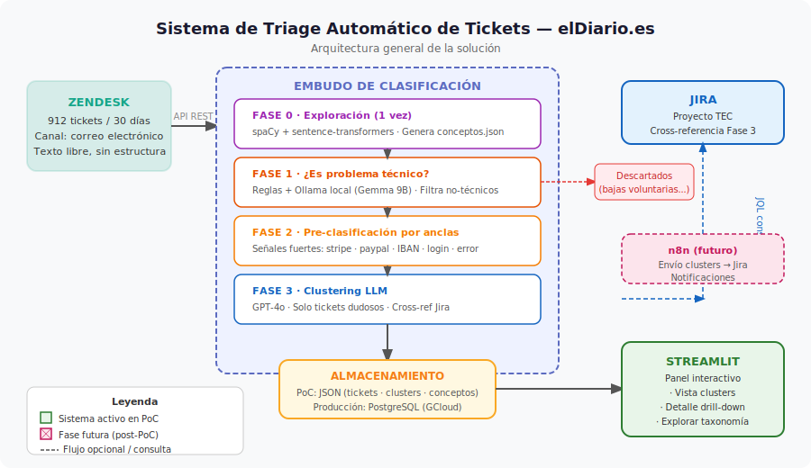
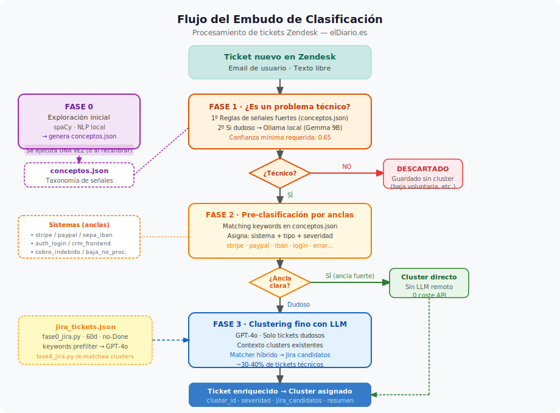

# Sistema de Triage Automático de Tickets Zendesk
## elDiario.es — Diseño del sistema

**Versión:** 1.0  
**Fecha:** 2026-04-15  
**Estado:** Aprobado para PoC  
**Equipo:** Tecnología / Producto

---

## 1. Contexto y problema

elDiario.es ha migrado su CRM. Desde la migración, el equipo de soporte recibe tickets en Zendesk (principalmente por correo electrónico) que son consecuencia de errores técnicos del nuevo CRM: cobros duplicados, bajas no procesadas, errores de acceso, fallos en pasarelas de pago, etc.

**El problema:** Estos tickets llegan mezclados con peticiones normales de usuarios (bajas voluntarias, consultas de factura, cambios de datos), y no hay forma sistemática de:

1. Detectar que un problema técnico del CRM está generando muchos tickets similares
2. Agrupar esos tickets por tipo de problema para priorizarlos
3. Cruzarlos con los tickets de desarrollo en Jira para saber si ya está siendo investigado

**El riesgo actual:** Un fallo en Stripe puede generar 20 tickets de "me han cobrado dos veces" sin que tecnología lo vea como un incidente hasta que alguien del equipo de soporte lo escale manualmente.

---

## 2. Solución propuesta

Un sistema de **triage automático en 3 fases** que analiza los tickets de Zendesk, filtra los que son problemas técnicos del CRM, los agrupa en clusters por similitud, y los presenta en un panel interactivo.

---

## 3. El embudo de clasificación

El sistema aplica un embudo de 4 fases progresivas. Cada fase procesa solo los tickets que la anterior no ha resuelto con confianza:

### Fase 0 — Exploración y generación de taxonomía

Se ejecuta una vez al inicio y cuando se quiera recalibrar. Descarga una muestra de tickets históricos (ej. últimos 30 días, ~912 tickets) y usa NLP local para descubrir:

- Palabras y conceptos más frecuentes
- Co-ocurrencias significativas (ej. "stripe" + "cobro dos veces")
- Categorías emergentes de problemas

El resultado es el archivo `conceptos.json`: la taxonomía de señales del sistema, editable manualmente.

### Fase 1 — Filtrado: ¿Es un problema técnico?

Cada ticket nuevo pasa por un filtro que determina si es consecuencia de un fallo técnico del CRM o una petición normal de usuario.

- Tickets claramente técnicos (contienen señales fuertes) → pasan al embudo
- Tickets claramente no técnicos → se descartan del clustering (pero se guardan)
- Tickets dudosos → un modelo LLM local (Ollama) decide

### Fase 2 — Pre-clasificación por señales fuertes

Los tickets técnicos se cruzan contra `conceptos.json` para asignar "anclas":
- Sistema afectado (stripe, paypal, IBAN, auth, frontend CRM...)
- Tipo de problema (cobro indebido, baja no procesada, error de acceso...)
- Severidad estimada

Los tickets con anclas claras van directamente a un cluster candidato. Los ambiguos pasan a Fase 3.

### Fase 3 — Clustering fino con LLM

GPT-4o analiza los tickets que han llegado aquí con el contexto de los clusters existentes y decide:
- Asignar el ticket a un cluster existente
- Crear un cluster nuevo si no hay uno apropiado
- Buscar tickets de Jira (proyecto TEC) que puedan estar relacionados

### Matching Cluster ↔ Jira

Cuando se crea o actualiza un cluster, el sistema busca tickets en Jira
(proyecto TEC, ya descargados en `data/jira_tickets.json`) que
representen el mismo problema técnico. Se usa un matcher híbrido:

1. **Prefiltrado por keywords** — tokens del resumen y anclas del cluster
   comparados contra `summary + description + labels` de cada Jira.
2. **Selección con GPT-4o** — de los 15 candidatos mejor puntuados, el
   LLM elige los que realmente corresponden al problema y devuelve
   confianza + razón.

Los tickets de Jira no se clusterizan; son un índice contra el que los
clusters de Zendesk se emparejan. Esto permite consolidar varios casos
de usuario en un Jira existente.

El script `fase0_jira.py` descarga los tickets de Jira (últimos 60 días,
excluyendo `statusCategory=done`). `fase4_jira.py` re-matchea clusters
existentes cuando hay nuevas Jiras.

---

## 4. Panel de visualización (Streamlit)

El panel tiene tres vistas:

### Vista Clusters
Lista de todos los clusters activos, ordenados por severidad. Para cada cluster:
- Nombre descriptivo, sistema afectado, tipo de problema
- Número de tickets y tendencia (creciente / estable / decreciente)
- Tickets de Jira candidatos
- Badge de severidad (HIGH / MEDIUM / LOW)

### Vista Detalle de Cluster
Al abrir un cluster:
- Resumen generado por el LLM
- Lista de tickets de Zendesk con preview del texto y confianza del clasificador
- Tickets de Jira relacionados (solo lectura en PoC)
- Historial temporal

### Vista Explorar
- Visualización y edición del `conceptos.json`
- Relanzar análisis exploratorio sobre últimos N días
- Estadísticas de procesamiento (cuántos tickets por fase, coste de API)

---

## 5. Almacenamiento

| Fase | Almacenamiento |
|------|---------------|
| PoC (local) | Archivos JSON (`data/`) |
| Producción | PostgreSQL (mismo servidor GCloud que n8n) |

La capa de almacenamiento (`storage.py`) abstrae la diferencia para facilitar la migración.

---

## 6. Integración futura con Jira y n8n

En la PoC, los tickets de Jira candidatos son solo lectura. En la siguiente fase:

1. Desde el panel Streamlit, el equipo selecciona un cluster y los Jira candidatos relacionados
2. Se activa un webhook a n8n
3. n8n enriquece los tickets de Jira con el conteo y resumen de incidencias de soporte
4. El cluster queda marcado como "vinculado a Jira" en el panel

---

## 7. Stack tecnológico

| Componente | Tecnología |
|-----------|-----------|
| NLP local (Fase 0) | spaCy `es_core_news_lg` + sentence-transformers |
| LLM local (Fase 1) | Ollama + Gemma 2 9B (Apple Silicon MPS) |
| LLM remoto (Fase 3) | OpenAI GPT-4o |
| API Zendesk | REST API v2 con token |
| API Jira | REST API v3 `/search/jql` (paginación por nextPageToken) |
| Panel | Streamlit |
| Almacenamiento PoC | JSON files |
| Almacenamiento prod | PostgreSQL 16 (GCloud) |
| Configuración | python-dotenv |

---

## 8. Criterios de éxito de la PoC

- [ ] Conexión con Zendesk API y descarga de tickets funcionando
- [ ] Script de exploración genera `conceptos.json` significativo con tickets reales
- [ ] El embudo clasifica correctamente al menos el 80% de los tickets de prueba
- [ ] Los clusters son coherentes y reconocibles por el equipo de soporte
- [ ] El panel Streamlit es usable para revisión diaria
- [ ] Coste de API GPT-4o inferior a $5/día

---

## 9. Lo que NO cubre esta PoC

- Envío automático de información a Jira (manual en esta fase)
- Integración con n8n (siguiente fase)
- Notificaciones automáticas cuando aparece un cluster nuevo
- Google Sheets (descartado en favor de Streamlit)
- Acceso multi-usuario al panel (local únicamente en PoC)
- Botón UI para adjuntar tickets Zendesk del cluster al ticket Jira candidato
- Re-ejecución automática del matcher cuando llegan Jiras nuevas
