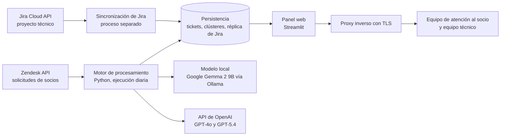
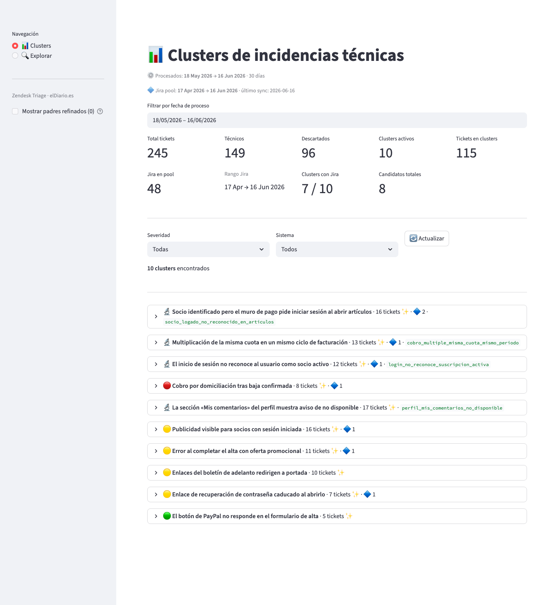
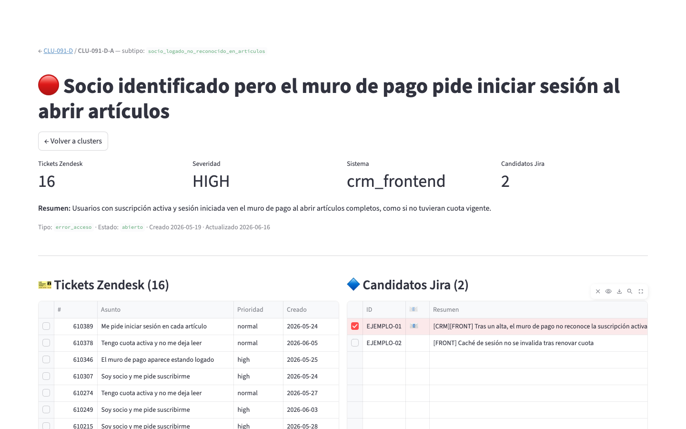
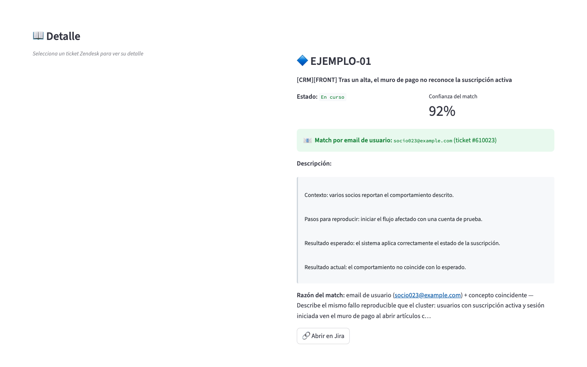
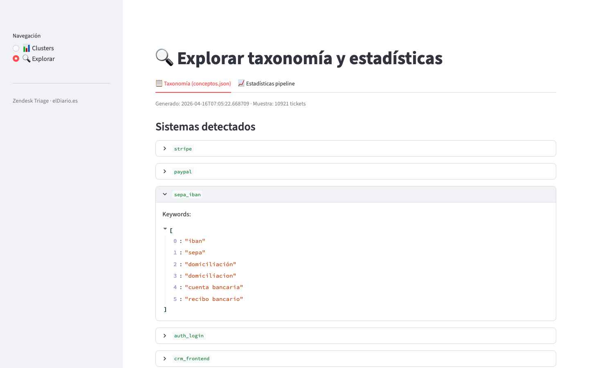
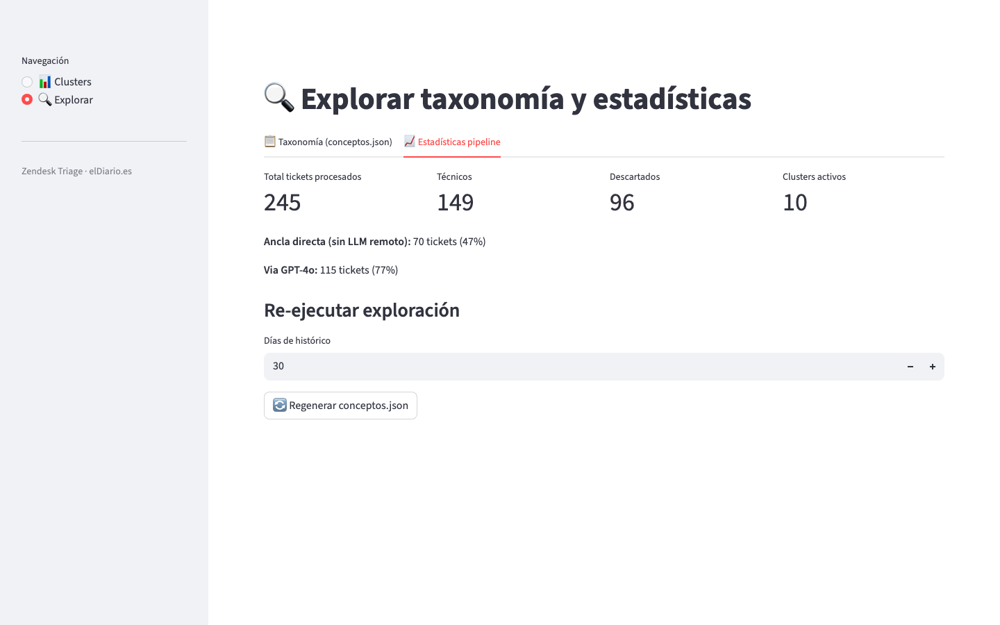

# Zendesk Triage — Descripción funcional

| | |
|---|---|
| **Entidad** | elDiario.es |
| **Área** | Producto |
| **Versión** | 1.0 |
| **Fecha de emisión** | 15/07/2026 |

## 1. Resumen funcional

Zendesk Triage es un sistema de triaje automático de las solicitudes que los socios de elDiario.es envían al servicio de atención a través de Zendesk. Una parte relevante de esas solicitudes no son peticiones voluntarias (bajas, cambios de datos, consultas), sino consecuencias de fallos técnicos del CRM, de las pasarelas de pago o del acceso web: cobros duplicados, bajas no aplicadas, socios a los que el sistema no reconoce al iniciar sesión o errores en formularios de alta. Llegan mezcladas con el resto del tráfico, y un mismo fallo puede aparecer como decenas de casos aislados.

El sistema separa a diario las solicitudes de origen técnico, las agrupa en clústeres por fallo concreto, estima su severidad y propone para cada clúster las tareas del proyecto técnico de Jira que describen el mismo problema. El resultado se presenta en un panel web compartido por el equipo de atención al socio y el equipo técnico, que deciden qué casos corresponden a qué tarea de desarrollo. Así se consolidan en una sola línea de trabajo casos antes dispersos y se detectan antes los fallos sistémicos.

## 2. Infraestructura técnica

El sistema consta de un motor de procesamiento en Python y un panel web. El motor se ejecuta de forma programada: descarga de Zendesk las solicitudes de las últimas 24 horas, resuelve el correo del solicitante mediante una caché local de usuarios y encadena el filtrado, la preclasificación, la agrupación con vinculación a Jira y la subdivisión de clústeres. La réplica local de las tareas abiertas del proyecto técnico de Jira (ventana de 60 días) se actualiza de forma incremental en un proceso separado, y otro proceso permite repetir la vinculación sobre los clústeres existentes.

El conjunto se aloja en una máquina virtual (VM) en Google Cloud compartida con otros servicios del laboratorio. El panel se publica tras un proxy inverso con TLS. El modelo local se ejecuta en la propia VM mediante Ollama, de modo que el filtrado de casos ambiguos no sale de la infraestructura; solo los casos que lo requieren se envían a la API de OpenAI.

| Componente | Tecnología | Función |
|---|---|---|
| Motor de procesamiento | Python 3.12, `requests`, `pandas` | Orquesta descarga, filtrado, agrupación, vinculación y subdivisión |
| Integración de atención al socio | API REST de Zendesk | Lectura de solicitudes, conversaciones y usuarios; etiquetado bajo demanda |
| Integración de desarrollo | API REST de Jira Cloud | Sincronización incremental de las tareas abiertas del proyecto técnico |
| Análisis lingüístico | spaCy (`es_core_news_lg`) | Extracción de vocabulario y coocurrencias para la taxonomía |
| Clasificación local | Google Gemma 2 9B (Ollama) | Decide si una solicitud ambigua es de origen técnico |
| Agrupación y vinculación | API de OpenAI (GPT-4o, GPT-5.4) | Agrupa solicitudes, subdivide clústeres y valida candidatos de Jira |
| Configuración | Fichero JSON versionado y variables de entorno | Taxonomía y parte de los umbrales |
| Persistencia | Ficheros JSON con escritura atómica | Tickets procesados, clústeres y réplica de Jira |
| Alojamiento | VM en Google Cloud compartida con otros servicios del laboratorio | Ejecución del motor, del modelo local y del panel |
| Acceso seguro | Proxy inverso con TLS | Publicación cifrada del panel web |

## 3. Uso de inteligencia artificial

| Funcionalidad | Qué hace la IA | Modelo |
|---|---|---|
| Construcción de la taxonomía | Lematiza y etiqueta gramaticalmente una muestra histórica de solicitudes para extraer los términos y coocurrencias más frecuentes | spaCy es_core_news_lg (ejecución local) |
| Filtrado técnico de casos ambiguos | Para las solicitudes que las reglas no resuelven, decide si son un error técnico o una petición voluntaria, con confianza numérica y justificación | Google Gemma 2 9B (ejecución local con Ollama) |
| Agrupación de incidencias | Compara cada solicitud técnica con los clústeres abiertos y la asigna a uno o crea uno nuevo con nombre, sistema, tipo, severidad y resumen | OpenAI GPT-4o |
| Subdivisión de clústeres heterogéneos | Divide los clústeres grandes o mezclados en subgrupos que describen un único fallo reproducible | OpenAI GPT-5.4 (OpenAI GPT-4o como respaldo) |
| Vinculación con Jira | Revisa las tareas preseleccionadas y elige las que describen el mismo fallo, con confianza y razón en lenguaje natural | OpenAI GPT-4o |

**Supervisión humana y control de calidad.** La IA propone y el equipo decide. El sistema no modifica tareas de Jira ni cierra tickets: el equipo técnico confirma cada asociación tras comparar ambos lados en el panel. El procesamiento sigue un embudo de coste creciente (reglas explícitas, modelo local y, al final, modelo remoto), de modo que la mayoría de las decisiones de filtrado se explican por reglas revisables. Las llamadas remotas usan temperatura 0,1 y respuesta en JSON estricto; los candidatos de Jira con confianza inferior a 0,7 se descartan salvo coincidencia del correo del socio, y cada propuesta conserva la razón del modelo. Los correos de dominios internos se excluyen de los cruces y la subdivisión de un clúster no se repite antes de 24 horas. Si falla la subdivisión, el sistema recurre a GPT-4o como respaldo. Si falla el modelo local, el ticket queda descartado con confianza 0 y el error anotado en su registro; si falla la agrupación, se crea un clúster genérico de severidad media, que el equipo identifica y revisa en el panel. La taxonomía y parte de los umbrales residen en ficheros de configuración que el equipo ajusta cuando aparecen patrones nuevos.

## 4. Descripción funcional avanzada

- **Descarga y normalización diaria de solicitudes.** El motor descarga de Zendesk las solicitudes de la ventana indicada (por defecto, 24 horas), descarta las ya procesadas y resuelve el correo del solicitante con una caché local que solo consulta a Zendesk los usuarios nuevos. También extrae los correos mencionados en el cuerpo. Cada ticket registra su fecha de proceso, que permite filtrar el panel por periodos.

- **Filtrado de solicitudes de origen técnico.** Cada solicitud pasa primero por señales explícitas de la taxonomía: expresiones como «quiero darme de baja» la descartan y otras como «me han cobrado dos veces» la marcan como técnica. Los casos en zona gris se resuelven con el modelo local, que devuelve tipo, confianza y justificación; solo se aceptan como técnicos por encima del umbral configurado. Las descartadas también se guardan para las métricas.

- **Preclasificación y agrupación por fallo concreto.** Las solicitudes técnicas se comparan con los sistemas (Stripe, PayPal, SEPA/IBAN, acceso, interfaz del CRM) y tipos de problema de la taxonomía. Cuando la coincidencia es nítida, el ticket queda etiquetado con una categoría candidata sin coste de API. El resto pasa al modelo remoto, que lo asigna a un clúster abierto o abre uno nuevo y redacta nombre, resumen y severidad. El panel principal muestra los clústeres activos ordenados por severidad y volumen, con el número de candidatos de Jira y métricas del periodo seleccionado.

  

- **Subdivisión de clústeres heterogéneos.** Tras cada ejecución, el sistema evalúa los clústeres con al menos 15 tickets o con un índice de heterogeneidad de sistemas superior a 0,5. Para ellos, un modelo de razonamiento propone subgrupos homogéneos por subtipo de fallo. El clúster original queda como padre refinado y sus hijos heredan sistema y severidad, reciben un subtipo descriptivo y se vinculan de nuevo con Jira.

- **Vinculación con las tareas de desarrollo en Jira.** Para cada clúster, un prefiltrado determinista puntúa las tareas abiertas por palabras clave comunes en título, descripción y etiquetas, y retiene las 15 mejores; a ellas se suman las tareas que mencionan el correo de algún socio afectado. El modelo remoto revisa esos candidatos y devuelve solo los que describen el mismo fallo reproducible, con confianza y razón.

- **Vista de detalle y comparación.** Cada clúster tiene una dirección propia compartible. Muestra severidad, sistema y resumen y, en paralelo, las solicitudes de Zendesk agrupadas y los candidatos de Jira con su confianza y un indicador de coincidencia por correo. Al seleccionar una fila se despliega el detalle: la conversación completa del ticket, con notas internas diferenciadas, o la descripción de la tarea con la razón del emparejamiento.

  

  

- **Taxonomía revisable y estadísticas de funcionamiento.** La sección de exploración muestra la taxonomía vigente (sistemas, tipos de problema con su severidad por defecto, palabras clave frecuentes y coocurrencias) y permite regenerarla a partir del histórico. Una segunda pestaña resume el volumen procesado, las solicitudes técnicas y descartadas, cuántas tienen un sistema detectado por reglas y cuántas han requerido el modelo remoto.

  

  
